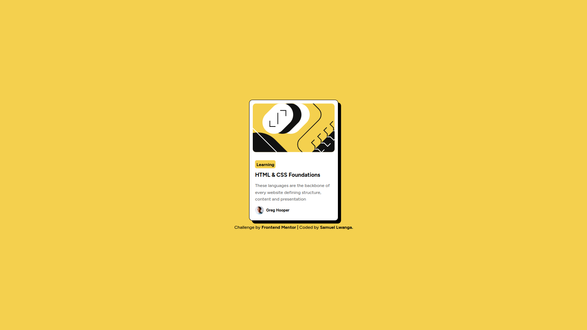

# Frontend Mentor | Blog preview card solution

This is a solution to the [Blog preview card challenge on Frontend Mentor](https://www.frontendmentor.io/challenges/blog-preview-card-ckPaj01IcS).

## Table of contents

- [Overview](#overview)
  - [The challenge](#the-challenge)
  - [Screenshot](#screenshot)
  - [Links](#links)
- [My process](#my-process)
  - [Built with](#built-with)
  - [What I learned](#what-i-learned)
  - [Useful resources](#useful-resources)
- [Author](#author)

## Overview

### The challenge

Users should be able to:

- See hover and focus states for all interactive elements on the page

### Screenshot



### Links

- [Solution URL](https://github.com/babyanonymouse/frontendmentor-blog-card)
- Live Site URL: [Add live site URL here](https://your-live-site-url.com)

## My process

### Built with

- Semantic HTML5 markup
- CSS custom properties
- Flexbox
- Mobile-first workflow
- [TailwindCSS](https://tailwindcss.com) - For styles

### What I learned

To link local fonts, I used the `@font-face` rule in CSS:

```css
@font-face {
  font-family: "Figtree";
  src: url("./assets/fonts/Figtree-VariableFont_wght.ttf") format("truetype");
  font-weight: 500 800;
}
```

For creating custom shadow properties, I extended the default TailwindCSS configuration in the `tailwind.config.js` file:

```js
module.exports = {
  theme: {
    extend: {
      boxShadow: {
        custom: "0 4px 6px rgba(0, 0, 0, 0.1)",
      },
    },
  },
};
```

This allowed me to apply a custom shadow to elements using the `shadow-custom` class.

### Useful resources

- [Tailwind Docs](https://www.tailwindcss.com) - This helped me for XYZ reason. I really liked this pattern and will use it going forward.

## Author

- Website - [Samuel Lwanga](https://babyanonymouse.github.io/Portfolio)
- Frontend Mentor - [@babyanonymouse](https://www.frontendmentor.io/profile/babyanonymousee)
- Twitter - [@BabyLilboss](https://www.twitter.com/BabyLilboss)
